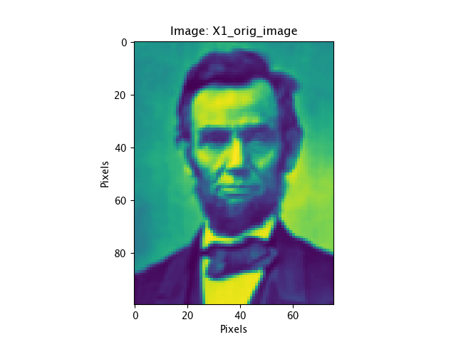
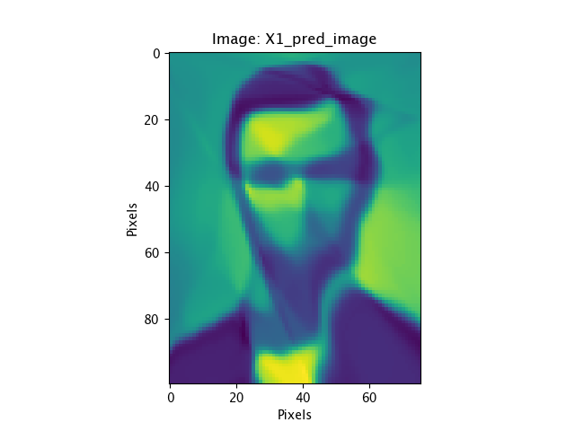

# Neural-Network-from-Scratch
A repository to create a neural network from scratch by using NumPy. It is used to learn a given image and predict the same image given the input image coordinates.

As a machine learning engineer or data scientist, it is important to not only be able to create complex neural networks with various architectures in Python, but also to have a deep understanding of how these networks function. This repository aims to provide a comprehensive foundation in building neural networks from scratch using only NumPy, with a focus on explaining the underlying concepts and techniques such as forward and backward propagation, gradient descent, and activation functions. By following the code provided in this repository, you will gain valuable insights into the inner workings of neural networks and be able to customize and implement your own networks without relying on pre-existing frameworks.

## Usage
This demonstration uses an input image file, "nn_data.mat", which contains two images with their pixel coordinates in the variables X1 and X2 and their respective color values in Y1 and Y2. To run the script, please use the following command.

```bash
python main.py
```

If you would like to use your own image files, you can replace "nn_data.mat" with the filename of your mat file.

The first file used to train the neural network and the predicted image file produced by the network are shown below:

<p align="center">
	
</p>

<p align="center">
	
</p>
